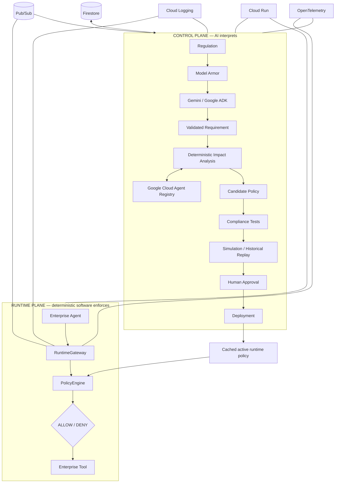

# RegOps architecture

Firestore is authoritative for lifecycle history. A validated active policy is
loaded into the process-local `PolicyRegistry`; neither Firestore, Pub/Sub,
logging, nor tracing participates in a single `PolicyEngine` decision.
