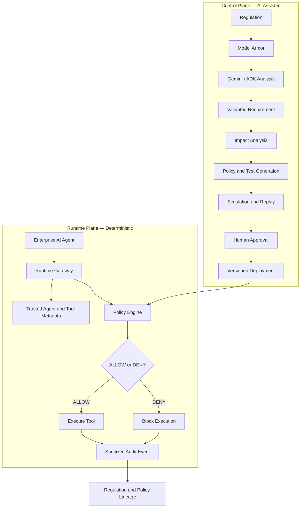

# RegOps

**CI/CD for AI-Agent Compliance**

RegOps converts regulatory text into validated compliance requirements, identifies affected enterprise AI agents, generates and tests candidate policies, requires human approval, and deterministically enforces approved policies at runtime.

> **Core principle:** AI assists with policy interpretation but never makes runtime authorization decisions.

---

## Overview

Enterprise AI agents can access sensitive data and tools such as customer databases, email providers, and payment processors. RegOps provides a traceable pipeline that answers:

- Which agents are affected by a regulation?
- What policy should be introduced?
- Will the policy block legitimate activity?
- Who reviewed and approved the policy?
- Why was an action allowed or denied?

Every runtime decision can be traced back to its policy, requirement, and source regulation.

---

## Architecture

## Architecture



### Control Plane

The control plane uses **Gemini** and **Google ADK** to:

1. Extract typed requirements with source evidence.
2. Identify affected agents and risky capability paths.
3. Generate constrained candidate policies.
4. Generate prohibited, legitimate, adversarial, and edge-case tests.
5. Simulate policy impact and regulatory blast radius.
6. Require authorized human approval.
7. Deploy or roll back fingerprint-verified policy versions.

All model output crosses strict **Pydantic validation boundaries** before use.

### Runtime Plane

The deterministic runtime plane:

1. Intercepts protected agent tool calls.
2. Resolves trusted agent and tool metadata.
3. Builds a normalized action context.
4. Evaluates the active policy.
5. Returns `ALLOW` or `DENY`.
6. Executes the tool only when allowed.
7. Records a sanitized audit event.

**No LLM calls occur in the runtime authorization path.**

---

## Key Features

- **Regulation analysis** with source-evidence validation
- **Deterministic impact analysis** across registered agents
- **AI-generated candidate policies** with strict validation
- **Adversarial compliance-test generation**
- **Baseline and candidate-policy simulation**
- **Historical replay and blast-radius calculation**
- **Role-based human review and approval**
- **Versioned policy deployment and rollback**
- **Deterministic runtime enforcement**
- **Sanitized audit events and regulation lineage**
- **Offline deterministic dashboard**
- **Local and Google Cloud infrastructure profiles**
- **OpenTelemetry instrumentation**

---

## Example Scenario

The included `RefundAgent` can read customer data, send email, and issue Stripe refunds.

After a financial compliance policy is approved and activated:

- Sending bank-account data through Gmail returns `DENY`.
- The denied Gmail operation is never executed.
- An authorized Stripe refund returns `ALLOW`.
- Both decisions produce sanitized audit records.
- The denial can be traced to its source regulation.

---

## Technology Stack

| Layer | Technologies |
|---|---|
| Backend | Python 3.11+, FastAPI, Pydantic |
| Frontend | Next.js, React, TypeScript |
| AI | Google ADK, Gemini 3.5 Flash |
| Testing | pytest |
| Cloud | Cloud Run, Firestore, Pub/Sub, Model Armor, Agent Registry, Vertex AI, Cloud Logging |
| Observability | OpenTelemetry |
| Packaging | Docker |

---

## Quick Start

### Prerequisites

- **Python 3.11+**
- **Node.js and npm**

### 1. Start the Backend

From the repository root:

```powershell
python -m pip install -e ".[test]"
python -m uvicorn regops.api:app --reload --port 8000
```

The API will be available at:

```text
http://localhost:8000
```

### 2. Start the Frontend

In another terminal:

```powershell
cd frontend
npm install
npm run dev
```

Open:

```text
http://localhost:3000
```

> The dashboard, runtime demonstrations, simulations, and audit lineage work offline without Gemini or Google Cloud credentials.

---

## Live Gemini Analysis

RegOps supports **Vertex AI** through Application Default Credentials:

```powershell
gcloud auth application-default login
Copy-Item .env.example .env
```

Configure `.env`:

```env
GOOGLE_GENAI_USE_VERTEXAI=TRUE
GOOGLE_CLOUD_PROJECT=your-project-id
GOOGLE_CLOUD_LOCATION=global
```

Alternatively, use the Gemini Developer API:

```env
GOOGLE_GENAI_USE_VERTEXAI=FALSE
GOOGLE_API_KEY=your-api-key
```

> **Security:** Never commit API keys, credentials, or local `.env` files.

---

## Testing

Run the complete test suite:

```powershell
python -m pytest -v
```

Normal unit tests do not require Gemini or Google Cloud credentials.

Run opt-in cloud integration tests:

```powershell
$env:RUN_GCP_INTEGRATION_TESTS="1"
python -m pytest -v -m integration
```

---

## Docker

The project includes separate production containers:

- [`Dockerfile`](Dockerfile) packages the FastAPI backend.
- [`frontend/Dockerfile`](frontend/Dockerfile) builds the Next.js dashboard.

The images are designed for deployment to **Google Cloud Run**.

```text
Dockerfile → Container Image → Artifact Registry → Cloud Run
```

---

## Google Cloud Deployment

Setting `REGOPS_ENV=cloud` enables:

- **Firestore** for lifecycle persistence
- **Pub/Sub** for lifecycle events
- **Model Armor** for regulation-input screening
- **Google Cloud Agent Registry** for agent discovery
- **Cloud Logging** for structured logs
- **Vertex AI** for Gemini access
- **Cloud Run** for application hosting

Cloud mode fails explicitly if required infrastructure is unavailable. It never silently falls back to local state.

See [`CLOUD_DEPLOYMENT.md`](CLOUD_DEPLOYMENT.md) for deployment instructions.

---

## Security Guarantees

- LLMs never make runtime authorization decisions.
- Candidate policies require explicit human approval.
- Caller-supplied permissions are not trusted.
- Tool callers cannot override trusted tool metadata.
- Denied tools are never executed.
- Sensitive raw tool arguments are not persisted.
- Execution failures are audited before propagation.
- Regulation text is treated as untrusted input.
- Invalid model output is rejected instead of silently repaired.
- Cloud authentication uses service identity and Application Default Credentials.

---

## Project Structure

```text
RegOps/
├── regops/              # Domain logic, agents, policies, gateway and API
├── tests/               # Unit and opt-in integration tests
├── frontend/            # Next.js dashboard
├── Dockerfile           # Backend production image
├── ARCHITECTURE.md      # System architecture
├── CLOUD_DEPLOYMENT.md  # Google Cloud deployment guide
├── DEMO.md              # Demonstration walkthrough
└── README.md
```

---

## Project Status

RegOps is a hackathon project demonstrating a production-oriented architecture for AI-agent compliance. It includes deterministic enforcement, policy lifecycle management, offline operation, and replaceable Google Cloud infrastructure adapters.
